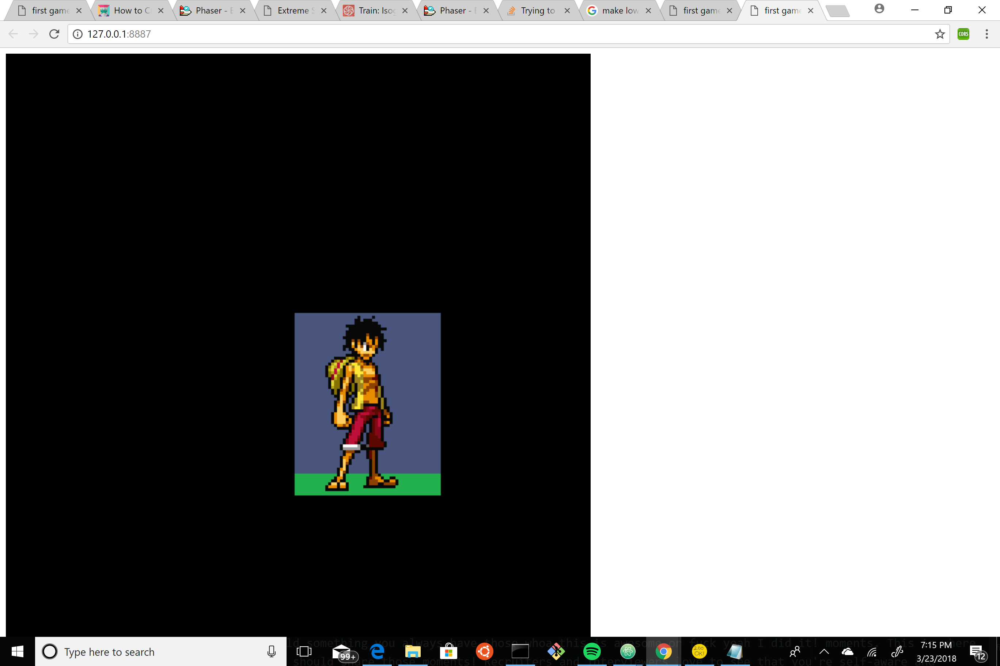

My first Phaser project
this is a way for me to introduce myself to the world of Phaser throughout the project I implement many of Phaser's fundamental methods
Link to project:

alt tag

How It's Made:
Tech used: HTML, CSS, JavaScript, Phaser

WIP to be updated soon
//MUST BE RUN ON A SERVER//
//CHROME MAY NOT WORK TRY OTHER BROWSERS//  
credit: (Youtube: Gamesfromscratch ) 
